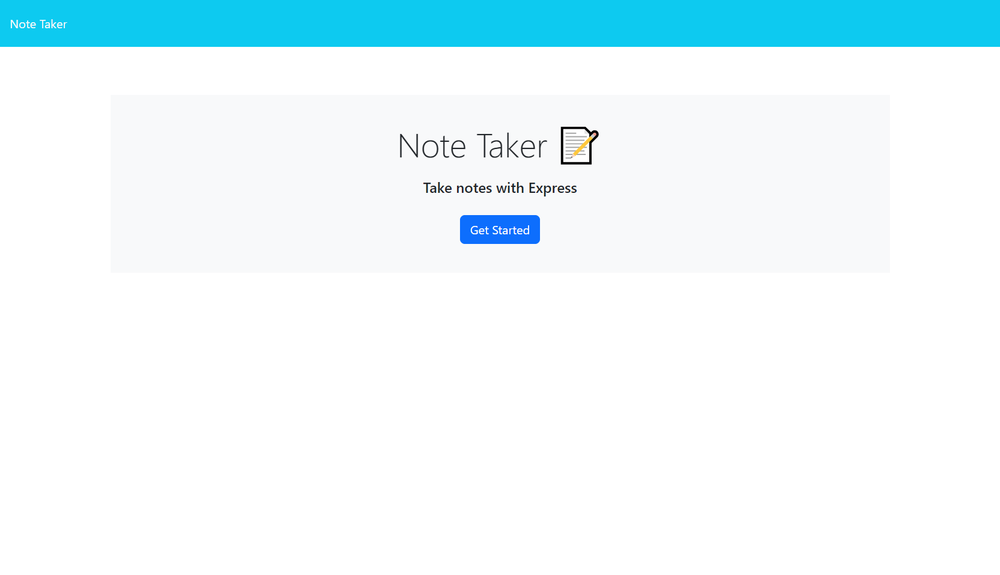
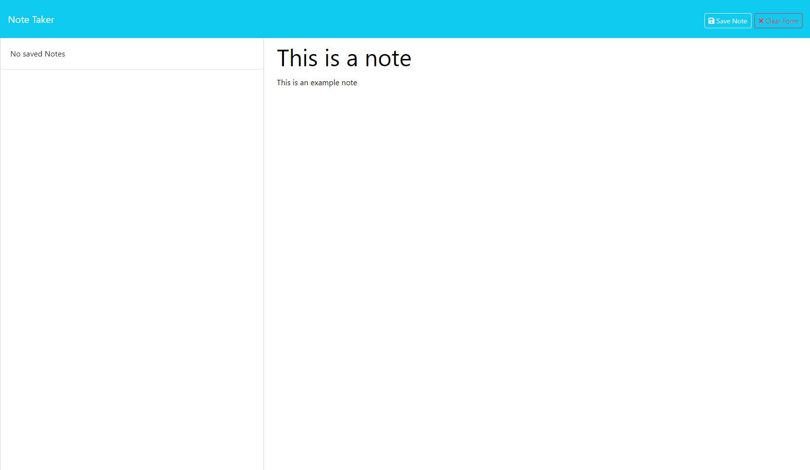

# Note Taker   

## Description

A webapp that allows user to create a persistent note on the web from any device with internet connection.

## Table of Contents

- [Installation](#installation)
- [Usage](#usage)
- [License](#license)
- [Contributing](#contributing)
- [Tests](#tests)
- [Questions](#questions)

## Installation

[Deployed App](https://note-taker-6i26.onrender.com)

## Usage

Go to the deployed app above and cliked on Get Started.
;

Fill in the title and the body of the note and hit Save Note on the top right.
;

## License

**Note Taker** is licensed under the [MIT License](https://github.com/sareacct91/{data.githubRepoName}/blob/master/LICENSE)

## Contributing

[Contributor Covenant](https://www.contributor-covenant.org/)

## Questions

https://github.com/sareacct91

If you have any questions email me at sareacct91@gmail.com